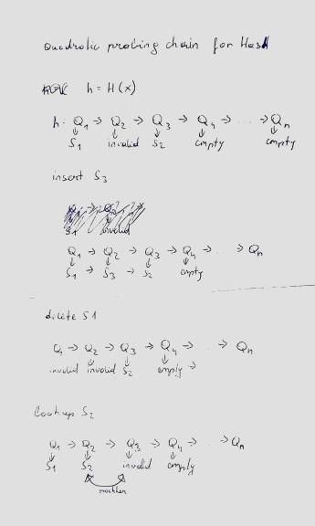

# README #

# UE1 Hashtable

## 1) Hashfunktion
* because modulo is an expensive operation we chose to have a table, which is a power of 2(since it is a trivial computation "shift")
* should be uniform
* should be fast
* sometimes specific length or value
* chose hash function from slides

## 2) Kollisionserkennung
* done via quadratic probing as demanded
* implemented with quadratic probing iterator

## 3) Verwaltung der Kursdaten
* Course data is imported from: http://de.finance.yahoo.com/q/hp?s=MSFT.

* Serializing of course data done via json library: https://github.com/nlohmann/json

## 4) Löschalgorithmus

## 5) Aufwandsabschätzung

### 5.1 insert, search delete Hashtable
**Best case: O(1)**  
**Worst case: O(n)**  
   * higher filling level (probing)  
   * n = table capacity
   
### 5.2 insert array
**Worst case O(1)**
### 5.3 delete array
**Worst case O(1)**
### 5.4 search array
* search for key 
    * **worst case: O(n)**  
    * **best case: O(1)**
* search via index  
    * **worst case O(1)** 

### 5.5 insert list
* **insert front O(1)**
* **insert back O(n)**
### 5.6 delete list
* **delete front O(1)**
* **delete back O(n)**
### 5.7 search list
* **worst case O(n)**

### 5.8 Benchmarks
   
